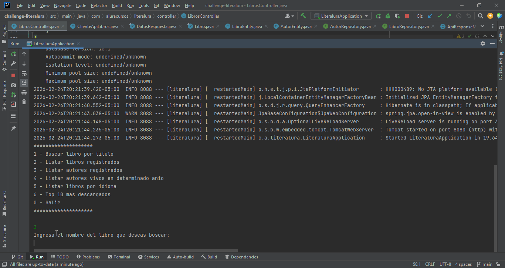

<div align="center">
  
</div>

# Literalura — Cliente y persistencia de libros 📚

---


Literalura es una aplicación de consola construida con **Spring Boot** que permite:

- Buscar libros desde la API pública **Gutendex**.  
- Guardar libros y autores en tu **base de datos PostgreSQL** local.  
- Consultar y listar libros y autores en múltiples formas (por título, por idioma, autores vivos en un año, etc.)  
- Mostrar toda la información en consola de forma clara y vertical.  

---

## 🎥 Demostración

<div align="center">
  
  <br>
  <em>Breve recorrido por las opciones del menú.</em>
</div>

---

## ✨ Características

1. **Buscar libro por título**: consulta la API, guarda en la base de datos si no existía y muestra título, autor(es), idioma y descargas en formato vertical.
2. **Listar libros registrados**: listado vertical desde la base de datos.
3. **Listar autores registrados**: listado vertical con fecha de nacimiento/fallecimiento y los libros asociados.
4. **Listar autores vivos en un año**: filtra autores según año, mostrando la información vertical.
5. **Listar libros por idioma**: permite seleccionar un idioma de forma vertical (`es`, `en`, `fr`, `pt`) y listar los libros correspondientes.
6. **Top 10 más descargados**: lista los 10 libros con mayor número de descargas almacenados en la base de datos, mostrando título, autor(es), idioma y cantidad de descargas en formato vertical y ordenados de mayor a menor.

---

## 🛠️ Tecnologías utilizadas
 
- Maven  
- Java 17+  
- JPA / Hibernate  
- RestTemplate para consumo de la API

---

## 📋 Requisitos previos

- Java 17+
- Spring Boot 3
- PostgreSQL
- Maven
- JPA / Hibernate
- RestTemplate 

---

## ⚙️ Configuración de la base de datos

Ejemplo usando `psql`:

```sql
CREATE DATABASE literalura_db;
CREATE USER literalura_user WITH ENCRYPTED PASSWORD 'tu_password_segura';
GRANT ALL PRIVILEGES ON DATABASE literalura_db TO literalura_user;
```

---

## 📝 Configura las credenciales en src/main/resources/application.properties:

```
spring.datasource.url=jdbc:postgresql://localhost:5432/literalura_db
spring.datasource.username=literalura_user
spring.datasource.password=tu_password_segura

spring.jpa.hibernate.ddl-auto=update
spring.jpa.show-sql=true
```
Nota: Ajusta la URL, usuario y contraseña según tu configuración local.

---

## 🚀 Ejecución

Maven:
```
mvn spring-boot:run
```
o ejecutando el JAR:
```
java -jar target/literalura-0.0.1-SNAPSHOT.jar
```

---

## 🖥️ Uso del menú

Al iniciar la app se verá:
```
********************
1 - Buscar libro por titulo
2 - Listar libros registrados
3 - Listar autores registrados
4 - Listar autores vivos en determinado anio
5 - Listar libros por idioma
6 - Top 10 mas descargados
0 - Salir
********************
```

---

## ➡️ Formato de salida (vertical y clara)
```
Libros:
Título: Don Quijote
Autor: Miguel de Cervantes Saavedra
Idioma: es
Descargas: 10926
------------------------

Autores:
Autor: Mary Shelley
Nacimiento: 1797
Fallecimiento: 1851
Libros: [Frankenstein, ...]
------------------------
```

---

## 🧪 Ejemplos
```
Ingrese el título del libro: pride and prejudice
Buscando...
Libro guardado correctamente.
Título: Pride and Prejudice
Autor(es): [Jane Austen]
Idioma: en
Descargas: 75482
```

---

## 🐛 Troubleshooting

- Datasource no configurado: revisa spring.datasource.url
- Duplicados: la app evita duplicar autores por nombre
- API no responde: Gutendex puede estar temporalmente fuera de servicio; espera unos minutos y reintenta.

---

## 🤝 Contribuciones

¡Las contribuciones son bienvenidas! Si deseas mejorar este proyecto, sigue estos pasos:
1. Haz un fork del repositorio.
2. Crea una rama para tu función (git checkout -b feature/nueva-funcion).
3. Realiza tus cambios y haz commit (git commit -m 'Agrega nueva función').
4. Sube los cambios (git push origin feature/nueva-funcion).
5. Abre un Pull Request.

---

## 📄 Licencia

MIT License — libre para usar, modificar y compartir.

---

## 👨‍💻 Desarrollador

<div align="center">
  
  <br>
  <strong>Julio César Valencia</strong>
  <br>
  <em>Desarrollador Java | Backend</em>
  <br>
  <a href="mailto:sesarisuma@gmail.com">📧 sesarisuma@gmail.com</a> •
  <a href="https://linkedin.com/in/julio-cesar-valencia">💼 LinkedIn</a> •
  <a href="https://github.com/JulioCesarValencia">🐙 GitHub</a>
</div>

---

## 🙏 Agradecimientos y créditos

- Alura Latam y Oracle Next Education (ONE): por brindar la formación y el reto de desarrollar este proyecto como parte de su programa educativo. Su metodología  práctica y el acompañamiento de los instructores fueron fundamentales para consolidar los conocimientos en Spring Boot, persistencia de datos y consumo de APIs.
- Gutendex: por ofrecer una API pública y gratuita con una vasta colección de libros, facilitando el consumo de datos reales para esta aplicación.
- Spring Boot y la comunidad Java: por la documentación, los foros y las herramientas que hicieron posible este desarrollo.
- A todos los que contribuyan con sugerencias, reportes de errores o mejoras en el código.

